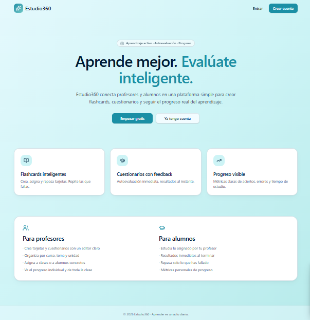

# 🎓 Estudio360 Smart Learn — Documentación del Proceso


> **Ejercicio Práctico — IA Generativa y Mejora de la Productividad**  
> Documentación completa del proceso de creación de **Estudio360 Smart Learn** con Lovable

## 📸 Vista Previa de la Aplicación



---

## 🔗 Aplicación en Producción

[](https://estudio-360-smart-learn-vercel.vercel.app/)
[](https://estudio360.netlify.app/)

> **Repos de código:** [Despliegue Vercel](https://github.com/migueljerico/estudio-360-smart-learn-vercel) · [Despliegue Netlify](https://github.com/migueljerico/estudio-360-smart-learn-netlify)

---

## 📋 Descripción del Proyecto

Este repositorio documenta el proceso completo de creación de **Estudio360 Smart Learn**, plataforma educativa desarrollada con **Lovable** para profesorado y alumnado de Educación Primaria.

Recoge los prompts utilizados, las iteraciones realizadas, las decisiones técnicas tomadas durante el despliegue y una reflexión crítica sobre el uso de IA generativa para la creación de aplicaciones.

---

## 🎯 Objetivo de la Aplicación

| Usuario | Necesidad resuelta |
|---|---|
| **Profesorado** | Crear, gestionar y asignar flashcards y cuestionarios por clase o grupo |
| **Alumnado** | Realizar autoevaluaciones personalizadas y seguir su propio progreso |

---

## ✨ Funcionalidades Principales

### 👩‍🏫 Para el Profesorado
- Creación y edición de **flashcards** y **quizzes** por tema o unidad
- Asignación de contenido a clases o grupos específicos
- Visualización de resultados agregados por alumno y por pregunta
- Detección de preguntas con mayor tasa de fallo para refuerzo
- Publicación y reutilización de contenido existente

### 🎒 Para el Alumnado
- Autoevaluaciones cortas y repetibles
- Seguimiento de progreso, aciertos, errores y temas pendientes
- Repaso de tarjetas falladas con mayor frecuencia
- Acceso exclusivo a su información y contenido asignado
- Feedback inmediato después de cada quiz

---

## 🤖 Proceso de Creación con Lovable

### Prompt inicial de generación

```
Crea una aplicación web educativa llamada Estudio 360.
La app debe tener dos roles principales: Profesor y Alumno.

Objetivo:
- Los profesores creen, editen y asignen contenido educativo
- Los alumnos realicen autoevaluaciones personalizadas
- Cada alumno vea únicamente sus propios datos, progreso y resultados

Funcionalidades para Profesor:
Crear/editar/eliminar flashcards y quizzes, organizar por curso/tema/unidad,
asignar a alumnos o grupos, ver progreso individual y estadísticas de clase,
detectar preguntas con más fallos, duplicar contenido existente.

Funcionalidades para Alumno:
Ver contenido asignado, estudiar flashcards en modo repaso,
realizar quizzes de autoevaluación, ver resultados inmediatos,
consultar historial de intentos y métricas personales,
repasar solo tarjetas o preguntas falladas.

Diseño: interfaz moderna, limpia y minimalista. Muy fácil de usar
en móvil y escritorio. Colores agradables, buena jerarquía visual.

Modelo de datos: Usuarios, Roles, Clases, Alumnos, Profesores,
Decks de flashcards, Quizzes, Preguntas, Respuestas, Intentos,
Progreso por usuario, Asignaciones de contenido.

Reglas: Un alumno solo puede ver sus propios datos.
Un profesor puede ver el contenido y progreso de sus alumnos.
```

---

## 🔄 Iteraciones y Mejoras

### Iteración 1 — Traducción al castellano

**Problema detectado:** Lovable generó las tarjetas y cuestionarios en inglés (`decks`, `quizzes`).

**Solución aplicada:** Se modificó el contenido a castellano para adaptarlo al público objetivo (alumnado de Educación Primaria en España).

---

## 🚀 Proceso de Despliegue

### Vercel
El despliegue inicial presentó un **error 404**. Tras análisis, se identificó que el problema era el valor incorrecto del preset en `vite.config.ts` (`netlify` en lugar de `vercel`). Una vez corregido, el despliegue funcionó correctamente.

### Netlify
El despliegue en Netlify fue exitoso desde el primer intento. El agente IA de Netlify detectó y corrigió automáticamente el código durante el proceso, facilitando la depuración.

| Plataforma | Resultado | Observación |
|---|---|---|
| **Vercel** | ✅ Exitoso | Requirió corrección manual del preset en vite.config |
| **Netlify** | ✅ Exitoso | El agente IA corrigió el código automáticamente |

---

## 💡 Reflexión Final

### Facilidades y Dificultades

La creación de la aplicación con Lovable fue la parte más ágil del proceso, destacando la eficiencia de la IA generativa para la generación inicial. La mayor dificultad fue el despliegue en Vercel, menos intuitivo para la depuración en comparación con Netlify.

### Riesgos y Limitaciones del Desarrollo con IA

| Riesgo | Descripción |
|---|---|
| **Falta de control** | La facilidad para implementar lógica sin comprensión profunda dificulta la corrección de fallos futuros |
| **Alucinaciones** | La IA puede generar soluciones incorrectas o ignorar aspectos de seguridad |
| **Visión limitada** | Pérdida de eficiencia en arquitecturas complejas o altamente escalables |

> **Conclusión:** La IA es un excelente copiloto para acelerar el desarrollo, pero requiere supervisión humana constante para asegurar la calidad y robustez del producto final.

---

## 🔮 Mejoras Futuras

1. **Generación de cuestionarios asistida por IA** — El profesor introduce un tema y la app genera un borrador de preguntas automáticamente
2. **Dashboards de análisis por rol** — Visualizaciones específicas para profesores (métricas de clase) y alumnos (seguimiento personal)
3. **Notificaciones automáticas** — Avisos a profesores y alumnos sobre asignaciones y feedback

---

## 🧰 Tecnologías utilizadas

| Herramienta | Uso |
|---|---|
| **Lovable** | Generación de la aplicación completa (no-code / low-code) |
| **Vercel** | Plataforma de despliegue (React + Vite) |
| **Netlify** | Plataforma de despliegue alternativa |
| **Supabase** | Backend, autenticación y base de datos |

---

## 📚 Contexto formativo

Este proyecto forma parte del módulo **Inteligencia Artificial Generativa y Mejora de la Productividad** (junio 2026). El objetivo fue diseñar, construir y desplegar una aplicación web útil para el entorno educativo utilizando herramientas de IA generativa y no-code, documentando todo el proceso de creación y las decisiones técnicas tomadas.

Proyecto realizado en equipo por **Francisco y Miguel**.

---

<p align="center">
  <sub>Desarrollado por <a href="https://github.com/migueljerico">@migueljerico</a> · 2026</sub>
</p>
